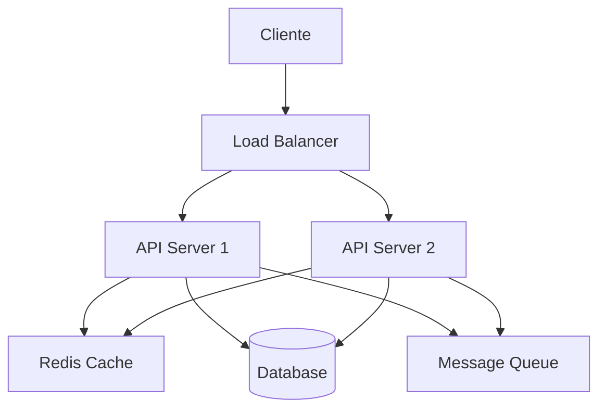

# 02 - Arquitectura del Sistema

> **Template Genérico** - Define decisiones arquitectónicas y diseño del sistema

## Visión General de la Arquitectura

**Nombre del Proyecto**: [NOMBRE_PROYECTO]

**Tipo de Arquitectura**: [Monolito/Microservicios/Serverless/Híbrido]

**Descripción**: [Breve descripción de la arquitectura elegida y por qué]

---

## Stack Tecnológico

### Backend (si aplica)

| Componente            | Tecnología             | Versión | Justificación                |
| --------------------- | ---------------------- | ------- | ---------------------------- |
| Framework             | [NestJS/Express/etc.]  | [X.Y.Z] | [Por qué se eligió]          |
| Lenguaje              | [TypeScript/Python/etc | [X.Y]   | [Por qué se eligió]          |
| Base de Datos         | [PostgreSQL/MongoDB]   | [X.Y]   | [Por qué se eligió]          |
| ORM/ODM               | [Prisma/TypeORM/etc.]  | [X.Y.Z] | [Por qué se eligió]          |
| Cache                 | [Redis/Memcached]      | [X.Y]   | [Por qué se eligió]          |
| Queue                 | [Bull/RabbitMQ]        | [X.Y]   | [Por qué se eligió]          |
| Testing               | [Jest/Vitest]          | [X.Y.Z] | [Por qué se eligió]          |

### Frontend (si aplica)

| Componente            | Tecnología             | Versión | Justificación                |
| --------------------- | ---------------------- | ------- | ---------------------------- |
| Framework             | [React/Vue/Angular]    | [X.Y.Z] | [Por qué se eligió]          |
| Lenguaje              | [TypeScript]           | [X.Y]   | [Por qué se eligió]          |
| State Management      | [Redux/Zustand/Pinia]  | [X.Y.Z] | [Por qué se eligió]          |
| Routing               | [React Router/etc.]    | [X.Y.Z] | [Por qué se eligió]          |
| UI Library            | [MUI/Chakra/Tailwind]  | [X.Y.Z] | [Por qué se eligió]          |
| Build Tool            | [Vite/Webpack]         | [X.Y.Z] | [Por qué se eligió]          |
| Testing               | [Jest/Vitest/Testing Library] | [X.Y.Z] | [Por qué se eligió] |

### DevOps & Infraestructura

| Componente            | Tecnología             | Versión | Justificación                |
| --------------------- | ---------------------- | ------- | ---------------------------- |
| Containerización      | [Docker]               | [X.Y]   | [Por qué se eligió]          |
| Orquestación          | [Kubernetes/Docker Compose] | [X.Y] | [Por qué se eligió]     |
| CI/CD                 | [GitHub Actions/GitLab CI] | [X.Y] | [Por qué se eligió]       |
| Hosting               | [AWS/GCP/Azure/Vercel] | N/A     | [Por qué se eligió]          |
| Monitoring            | [Prometheus/Datadog]   | [X.Y]   | [Por qué se eligió]          |
| Logging               | [Winston/Pino]         | [X.Y.Z] | [Por qué se eligió]          |

---

## Principios Arquitectónicos

### 1. [Principio 1: ej. "Separation of Concerns"]

**Descripción**: [Qué significa este principio]

**Aplicación**: [Cómo se aplica en el proyecto]

**Ejemplo**:

```
[Código o diagrama mostrando el principio]
```

### 2. [Principio 2: ej. "Single Responsibility"]

**Descripción**: [Qué significa este principio]

**Aplicación**: [Cómo se aplica en el proyecto]

### 3. [Principio 3: ej. "Dependency Injection"]

**Descripción**: [Qué significa este principio]

**Aplicación**: [Cómo se aplica en el proyecto]

---

## Patrones de Diseño

### Patrón 1: [Nombre del Patrón - ej. "Repository Pattern"]

**Propósito**: [Por qué usamos este patrón]

**Implementación**: [Cómo se implementa en el proyecto]

**Ejemplo**:

```typescript
// Ejemplo de código mostrando el patrón
interface Repository<T> {
  findById(id: string): Promise<T | null>;
  findAll(filter?: Filter): Promise<T[]>;
  create(data: CreateDTO): Promise<T>;
  update(id: string, data: UpdateDTO): Promise<T>;
  delete(id: string): Promise<void>;
}
```

**Reglas**:

- [ ] [Regla 1 obligatoria al usar este patrón]
- [ ] [Regla 2 obligatoria al usar este patrón]

### Patrón 2: [Nombre del Patrón - ej. "Strategy Pattern"]

[Seguir mismo formato que Patrón 1]

### Patrón 3: [Nombre del Patrón - ej. "Factory Pattern"]

[Seguir mismo formato que Patrón 1]

---

## Arquitectura de Capas

### Diagrama de Capas

```
┌─────────────────────────────────────────────┐
│         Presentation Layer                  │
│  (Controllers/Components/UI)                │
├─────────────────────────────────────────────┤
│         Business Logic Layer                │
│  (Services/Use Cases)                       │
├─────────────────────────────────────────────┤
│         Data Access Layer                   │
│  (Repositories/DAOs)                        │
├─────────────────────────────────────────────┤
│         Data Layer                          │
│  (Database/Cache/External APIs)             │
└─────────────────────────────────────────────┘
```

### Capa de Presentación

**Responsabilidad**: [Qué hace esta capa]

**Componentes**:

- [Componente 1: ej. Controllers]
- [Componente 2: ej. DTOs]
- [Componente 3: ej. Validators]

**Reglas**:

- [ ] [Regla 1: ej. "No contiene lógica de negocio"]
- [ ] [Regla 2: ej. "Solo valida inputs y formatea outputs"]

### Capa de Lógica de Negocio

**Responsabilidad**: [Qué hace esta capa]

**Componentes**:

- [Componente 1: ej. Services]
- [Componente 2: ej. Use Cases]
- [Componente 3: ej. Domain Models]

**Reglas**:

- [ ] [Regla 1: ej. "Contiene toda la lógica de negocio"]
- [ ] [Regla 2: ej. "No accede directamente a la base de datos"]

### Capa de Acceso a Datos

**Responsabilidad**: [Qué hace esta capa]

**Componentes**:

- [Componente 1: ej. Repositories]
- [Componente 2: ej. Data Mappers]
- [Componente 3: ej. Query Builders]

**Reglas**:

- [ ] [Regla 1: ej. "Única capa que accede a la base de datos"]
- [ ] [Regla 2: ej. "Retorna entidades de dominio, no modelos de BD"]

---

## Módulos del Sistema

### Módulo 1: [Nombre del Módulo]

**Responsabilidad**: [Qué hace este módulo]

**Componentes**:

```
module-name/
├── dto/                    # Data Transfer Objects
├── entities/               # Domain entities
├── interfaces/             # Contracts
├── [nombre].controller.ts  # API endpoints
├── [nombre].service.ts     # Business logic
├── [nombre].repository.ts  # Data access
└── [nombre].module.ts      # Module definition
```

**Dependencias**:

- Depende de: [Lista de módulos de los que depende]
- Usado por: [Lista de módulos que lo usan]

**APIs Públicas**:

- `[método1](params): [ReturnType]` - [Descripción]
- `[método2](params): [ReturnType]` - [Descripción]

### Módulo 2: [Nombre del Módulo]

[Seguir mismo formato que Módulo 1]

---

## Manejo de Errores

### Estrategia de Errores

**Principios**:

1. [Principio 1: ej. "Fallar rápido"]
2. [Principio 2: ej. "Errores tipados"]
3. [Principio 3: ej. "Nunca exponer internals al usuario"]

### Jerarquía de Excepciones

```typescript
// Ejemplo de jerarquía de excepciones personalizada
abstract class ApplicationError extends Error {
  constructor(
    public readonly code: string,
    public readonly statusCode: number,
    message: string,
  ) {
    super(message);
  }
}

class ValidationError extends ApplicationError {
  constructor(message: string) {
    super('VALIDATION_ERROR', 400, message);
  }
}

class NotFoundError extends ApplicationError {
  constructor(resource: string) {
    super('NOT_FOUND', 404, `${resource} not found`);
  }
}
```

### Manejo de Errores por Capa

**Controllers/Presentación**:

- Captura errores de la capa de negocio
- Convierte a respuestas HTTP apropiadas
- Nunca expone stack traces en producción

**Services/Lógica de Negocio**:

- Lanza excepciones de dominio específicas
- Valida reglas de negocio
- Propaga errores con contexto

**Repositories/Acceso a Datos**:

- Convierte errores de BD a excepciones de dominio
- Maneja errores de conexión
- Implementa retry logic si es necesario

---

## Seguridad

### Autenticación

**Estrategia**: [JWT/OAuth2/Session-based/etc.]

**Implementación**:

```typescript
// Ejemplo de flujo de autenticación
1. Usuario envía credenciales
2. Sistema valida contra base de datos
3. Si válido, genera [token/session]
4. Cliente incluye [token/session] en requests subsecuentes
5. Middleware valida [token/session] antes de procesar request
```

**Configuración**:

- Token expiration: [X] horas
- Refresh token: [Sí/No]
- Storage: [LocalStorage/Cookie/etc.]

### Autorización

**Modelo**: [RBAC/ABAC/ACL]

**Roles definidos**:

- `[ROLE_1]`: [Permisos]
- `[ROLE_2]`: [Permisos]
- `[ROLE_3]`: [Permisos]

**Implementación**:

```typescript
// Ejemplo de decorador/guard de autorización
@RequireRole('admin')
@RequirePermission('users:delete')
async deleteUser(id: string) {
  // Solo accesible si el usuario tiene el rol 'admin'
  // Y el permiso 'users:delete'
}
```

### Protecciones

- [ ] **Input Validation**: Validar y sanitizar todas las entradas
- [ ] **SQL Injection**: Usar prepared statements/ORMs
- [ ] **XSS**: Escapar outputs, CSP headers
- [ ] **CSRF**: Tokens CSRF para operaciones state-changing
- [ ] **Rate Limiting**: [X] requests por [Y] tiempo
- [ ] **HTTPS**: Forzar HTTPS en producción
- [ ] **Secrets**: No hardcodear, usar variables de entorno

---

## Performance

### Estrategias de Optimización

**Caching**:

- **Estrategia**: [Cache-aside/Write-through/etc.]
- **TTL**: [X] minutos/horas
- **Invalidación**: [Por evento/Por tiempo/Manual]

**Ejemplo**:

```typescript
// Ejemplo de caching
@Cache({ ttl: 3600 }) // 1 hora
async getUser(id: string): Promise<User> {
  // Si está en cache, retorna desde cache
  // Si no, ejecuta query y guarda en cache
}
```

**Database Optimization**:

- [ ] Índices en campos frecuentemente consultados
- [ ] Paginación para queries grandes
- [ ] Uso de `select` específico (no `SELECT *`)
- [ ] Connection pooling configurado

**Query Optimization**:

```typescript
// ❌ N+1 Problem
for (const user of users) {
  const posts = await postsRepo.findByUserId(user.id); // N queries
}

// ✅ Batch Query
const userIds = users.map(u => u.id);
const posts = await postsRepo.findByUserIds(userIds); // 1 query
```

**Lazy Loading vs Eager Loading**:

- Lazy: [Cuándo usarlo]
- Eager: [Cuándo usarlo]

---

## Escalabilidad

### Estrategia de Escalamiento

**Horizontal**: [Descripción de cómo escalar horizontalmente]

**Vertical**: [Descripción de cómo escalar verticalmente]

### Stateless Design

**Principio**: [Por qué el sistema es stateless]

**Implementación**:

- [ ] No guardar estado en memoria del servidor
- [ ] Sesiones en cache distribuido (Redis)
- [ ] Tokens JWT self-contained

### Load Balancing

**Estrategia**: [Round-robin/Least connections/etc.]

**Implementación**: [Nginx/AWS ALB/etc.]

---

## Monitoreo y Observabilidad

### Logging

**Niveles**:

- `ERROR`: [Qué se logea]
- `WARN`: [Qué se logea]
- `INFO`: [Qué se logea]
- `DEBUG`: [Qué se logea - solo desarrollo]

**Formato**:

```json
{
  "timestamp": "2025-12-16T10:30:00Z",
  "level": "INFO",
  "service": "[SERVICE_NAME]",
  "traceId": "[TRACE_ID]",
  "message": "[MESSAGE]",
  "context": {}
}
```

### Métricas

**Métricas de Negocio**:

- [Métrica 1: ej. "Usuarios activos diarios"]
- [Métrica 2: ej. "Transacciones completadas"]
- [Métrica 3: ej. "Tasa de conversión"]

**Métricas Técnicas**:

- Response time (p50, p95, p99)
- Error rate
- Request throughput
- Database connection pool usage
- Cache hit rate

### Alertas

**Críticas** (Despertar a alguien):

- Error rate > [X]%
- Response time p95 > [X]ms
- Uptime < [X]%

**Warnings** (Revisar durante horario laboral):

- Disk usage > [X]%
- Memory usage > [X]%
- Cache hit rate < [X]%

---

## Decisiones Arquitectónicas (ADRs)

### ADR-001: [Título de la Decisión]

**Fecha**: YYYY-MM-DD

**Estado**: [Propuesta/Aceptada/Rechazada/Obsoleta]

**Contexto**: [Por qué necesitamos tomar esta decisión]

**Decisión**: [Qué decidimos hacer]

**Alternativas consideradas**:

1. [Alternativa 1]: [Por qué no se eligió]
2. [Alternativa 2]: [Por qué no se eligió]

**Consecuencias**:

- **Positivas**:
  - [Consecuencia positiva 1]
  - [Consecuencia positiva 2]
- **Negativas**:
  - [Consecuencia negativa 1]
  - [Consecuencia negativa 2]

**Validación**: [Cómo validamos que fue la decisión correcta]

### ADR-002: [Título de la Decisión]

[Seguir mismo formato que ADR-001]

---

## Diagrama de Arquitectura

```
[Incluir diagrama visual de la arquitectura]
Puede ser en formato:
- Mermaid
- PlantUML
- Draw.io (exportado como imagen)
- Excalidraw
```

**Ejemplo con Mermaid**:



---

## Testing Strategy

### Pirámide de Testing

```
        /\
       /E2E\         <- Pocos tests, lentos, costosos
      /------\
     /  Int   \      <- Tests moderados, velocidad media
    /----------\
   /   Unit     \    <- Muchos tests, rápidos, baratos
  /--------------\
```

**Distribución objetivo**:

- Unit Tests: [X]% de coverage
- Integration Tests: [Y]% de casos críticos
- E2E Tests: [Z]% de flujos principales

### Estrategia de Mocking

**Qué mockear**:

- [ ] Llamadas a APIs externas
- [ ] Base de datos (en unit tests)
- [ ] Servicios de terceros
- [ ] File system operations

**Qué NO mockear**:

- [ ] Lógica de negocio propia
- [ ] Utilidades simples
- [ ] [Otros casos específicos del proyecto]

---

## Migraciones y Versionado

### Estrategia de Migraciones de BD

**Herramienta**: [Knex/TypeORM/Prisma/Alembic/etc.]

**Proceso**:

1. Crear migración con nombre descriptivo
2. Revisar SQL generado
3. Probar en entorno de desarrollo
4. Aplicar en staging
5. Validar en staging
6. Aplicar en producción (con rollback plan)

**Naming convention**: `YYYYMMDDHHMMSS_descripcion_de_cambio.ext`

### API Versioning

**Estrategia**: [URL-based/Header-based/Query-param]

**Ejemplo**:

```
v1: /api/v1/users
v2: /api/v2/users

O con headers:
Accept: application/vnd.api+json; version=1
```

**Política de deprecación**:

- Versiones soportadas simultáneamente: [X]
- Periodo de aviso de deprecación: [X] meses
- Timeline de sunset: [X] meses después del anuncio

---

## Deployment

### Estrategia de Deployment

**Tipo**: [Blue-Green/Canary/Rolling/Recreate]

**Proceso**:

1. [Paso 1]
2. [Paso 2]
3. [Paso 3]

**Rollback**:

- Procedimiento: [Cómo hacer rollback]
- Tiempo estimado: [X] minutos

### Entornos

| Entorno    | Propósito                  | URL                  | Auto-deploy |
| ---------- | -------------------------- | -------------------- | ----------- |
| Development | Desarrollo local          | localhost:XXXX       | No          |
| Staging    | Testing pre-producción     | staging.example.com  | Sí (develop)|
| Production | Usuarios finales           | example.com          | No (manual) |

---

## Historial de Cambios Arquitectónicos

| Fecha      | Cambio                           | Razón                | Impacto |
| ---------- | -------------------------------- | -------------------- | ------- |
| YYYY-MM-DD | [Descripción del cambio]         | [Por qué se hizo]    | [Alto/Medio/Bajo] |

---

**Versión del documento**: 1.0.0  
**Última actualización**: [FECHA]  
**Próxima revisión**: [FECHA]  
**Arquitecto responsable**: [NOMBRE]
